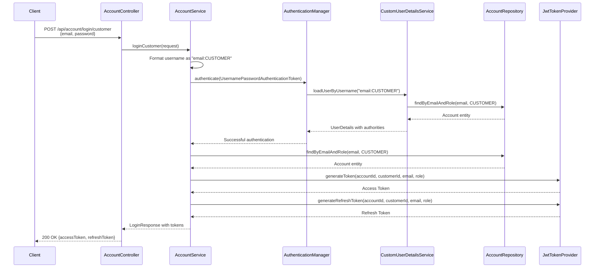

# Login Feature Sequence Diagram

```mermaid
sequenceDiagram
    participant Client
    participant AccountController
    participant AccountService
    participant AuthenticationManager
    participant CustomUserDetailsService
    participant AccountRepository
    participant JwtTokenProvider

    Client->>AccountController: POST /api/account/login/customer<br/>{email, password}
    AccountController->>AccountService: loginCustomer(request)
    AccountService->>AccountService: Format username as "email:CUSTOMER"
    AccountService->>AuthenticationManager: authenticate(UsernamePasswordAuthenticationToken)
    AuthenticationManager->>CustomUserDetailsService: loadUserByUsername("email:CUSTOMER")
    CustomUserDetailsService->>AccountRepository: findByEmailAndRole(email, CUSTOMER)
    AccountRepository-->>CustomUserDetailsService: Account entity
    CustomUserDetailsService-->>AuthenticationManager: UserDetails with authorities
    AuthenticationManager-->>AccountService: Successful authentication
    AccountService->>AccountRepository: findByEmailAndRole(email, CUSTOMER)
    AccountRepository-->>AccountService: Account entity
    AccountService->>JwtTokenProvider: generateToken(accountId, customerId, email, role)
    JwtTokenProvider-->>AccountService: Access Token
    AccountService->>JwtTokenProvider: generateRefreshToken(accountId, customerId, email, role)
    JwtTokenProvider-->>AccountService: Refresh Token
    AccountService-->>AccountController: LoginResponse with tokens
    AccountController-->>Client: 200 OK {accessToken, refreshToken}
```